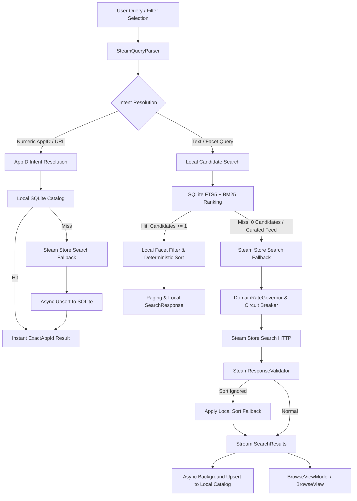

# BlueStar Steam Search Engine: Technical & Developer Guide

## Executive Overview
The BlueStar Explore and Browse engine has been completely re-architected from a fragile HTML-scraping model into an **offline-first, layered, high-performance Steam search engine**.

Key Capabilities:
- **Instant Search (<1ms)**: Local SQLite database with FTS5 (`apps_fts`) provides deterministic candidate matching across 100,000+ Steam titles.
- **Deterministic AppID & URL Resolution**: Automatically identifies raw AppIDs (`570`), prefixed queries (`appid:570`, `app:570`), store URLs (`store.steampowered.com/app/570/...`), and Steam client protocol URIs (`steam://rungameid/570`), resolving directly to the target application.
- **Zero-Flicker Reactive UI**: State-machine driven UI (`SearchState` enum: `Idle`, `LoadingInitial`, `Refreshing`, `ShowingResults`, `Empty`, `Error`) guarantees existing cards remain interactive during background page fetches.
- **Steam Anomaly Detection & Local Sort Fallback**: Real-time response validation intercepts cases where Steam quietly ignores sort parameters (e.g. `Reviews_ASC` returning identical listings to `Reviews_DESC`) and deterministically enforces sorting in memory.
- **Statistical Quality Metric (Wilson Score Interval)**: 95% confidence lower-bound rating calculation prevents games with 1 positive review (100%) from outranking titles with 50,000 reviews (97%).
- **Prioritized Lazy Enrichment**: Multi-priority queue (P0: active item, P1: active filters, P2: visible view, P3: background prefetch) enriches DRM, third-party launcher, and DLC metadata without bursting Steam rate limits.
- **Domain-Isolated Rate Governor & Circuit Breaker**: Separate budgets and circuit breakers for `store.steampowered.com` vs `api.steampowered.com`, with exponential backoff and randomized jitter to eliminate rate-limit IP bans.
- **WPF UI Virtualization**: Custom `VirtualizingWrapPanel` recycled UI containers drastically reducing memory consumption and scroll stutter.
- **Zero Embedded API Keys**: No Steam Web API Keys are baked into the client executable.

---

## Architecture Pipeline



---

## Query Parser Capabilities

The `SteamQueryParser` extracts canonical Steam identifiers from diverse user inputs:

| Input Format | Sample String | Detected AppId | Normalized Term |
|---|---|---|---|
| Pure Numeric | `570` or ` 730 ` | `570` / `730` | `null` |
| Prefixed | `appid:570`, `app=1091500` | `570` / `1091500` | `null` |
| Store Web URL | `https://store.steampowered.com/app/570/Dota_2/` | `570` | `null` |
| Community URL | `https://steamcommunity.com/app/1091500` | `1091500` | `null` |
| Client URI Protocol | `steam://rungameid/570` | `570` | `null` |
| General Free Text | `The Witcher 3: Wild Hunt` | `null` | `the witcher 3 wild hunt` |
| Diacritic / Punctuated | `Pokémon Trading Card Game` | `null` | `pokemon trading card game` |

---

## Local Catalog & FTS5 Indexing

The offline catalog database resides at `%AppData%/BlueStar/catalog.db` with WAL mode enabled.
It uses SQLite's full-text search engine (FTS5) with the `unicode61 remove_diacritics 2` tokenizer.

### Schema Summary:
```sql
CREATE TABLE apps (
    app_id INTEGER PRIMARY KEY,
    name TEXT NOT NULL,
    normalized_name TEXT NOT NULL,
    compact_name TEXT NOT NULL,
    app_type TEXT NOT NULL DEFAULT 'game',
    last_modified INTEGER NOT NULL DEFAULT 0,
    price_change_number INTEGER NOT NULL DEFAULT 0,
    review_percent INTEGER,
    review_count INTEGER,
    positive_reviews INTEGER,
    negative_reviews INTEGER,
    rating_updated_at INTEGER,
    header_image_url TEXT,
    price_text TEXT,
    discount_percent INTEGER NOT NULL DEFAULT 0,
    release_date_text TEXT,
    has_windows INTEGER NOT NULL DEFAULT 1,
    has_mac INTEGER NOT NULL DEFAULT 0,
    has_linux INTEGER NOT NULL DEFAULT 0,
    is_nsfw INTEGER NOT NULL DEFAULT 0,
    has_drm INTEGER NOT NULL DEFAULT 0,
    has_external_launcher INTEGER NOT NULL DEFAULT 0,
    tag_ids TEXT
);

CREATE VIRTUAL TABLE apps_fts USING fts5(
    name,
    normalized_name,
    compact_name,
    content='apps',
    content_rowid='app_id',
    tokenize='unicode61 remove_diacritics 2'
);
```

---

## Dual Selectors (POOL + SORT)

The Explore toolbar exposes two orthogonal selectors:
1. **POOL ("Mostrar")**: Defines the universe of games to inspect:
   - `all`: The entire global catalog (local SQLite index + Steam fallback).
   - `popularnew`: New & Trending releases.
   - `globaltopsellers`: Global top sellers.
   - `specials`: Active discounts and promotional sales.
   - `comingsoon`: Unreleased upcoming titles.
2. **SORT ("Ordenar")**: Controls deterministic ordering:
   - `Relevance`: BM25 rank in FTS5 or store ranking.
   - `Name`: Alphabetical sorting (A-Z or Z-A).
   - `Released`: Release date (newest or oldest first).
   - `Reviews`: Positive rating percentage with Wilson score interval confidence.
   - `ReviewsCount`: Total user review count.
   - `Price`: Discount / price ordering.
   - `AppId`: Numeric Steam application ID.

---

## Statistical Ranking: Wilson Score Interval

To solve the small-sample bias where a game with 1 review (100% positive) ranks above a game with 100,000 reviews (97% positive), BlueStar uses the lower bound of the Wilson score confidence interval:

$$w = \frac{\hat{p} + \frac{z^2}{2n} - z \sqrt{\frac{\hat{p}(1-\hat{p}) + \frac{z^2}{4n}}{n}}}{1 + \frac{z^2}{n}}$$

Where:
- $\hat{p} = \frac{\text{positive}}{\text{total}}$ is the observed positive review proportion.
- $n = \text{positive} + \text{negative}$ is the sample size.
- $z = 1.96$ corresponds to a 95% confidence level.

---

## Smoke Test CLI Tool

A standalone CLI tool is provided at `tools/steam-search-smoke/` to verify query parsing, local catalog search, benchmark latency, and anomaly detection:

```bash
# Test deterministic AppID parsing and local lookup
dotnet run --project tools/steam-search-smoke/steam-search-smoke.csproj -- --query "570"

# Test name search with performance benchmark
dotnet run --project tools/steam-search-smoke/steam-search-smoke.csproj -- --query "cyberpunk" --benchmark

# Test opposing sort anomaly detection
dotnet run --project tools/steam-search-smoke/steam-search-smoke.csproj -- --anomaly-test
```
